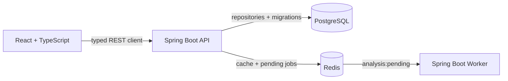

# Repository Intelligence

Repository Intelligence is a full-stack foundation for measuring the engineering health of GitHub repositories. The frontend uses live backend data for repository listing, creation, details, and analysis-job history while analytical metrics remain mocked. The backend stores repository coordinates, caches repository reads, and queues placeholder analysis work. It does not yet clone repositories or calculate analytics.

## Architecture



| Component | Responsibility |
| --- | --- |
| `frontend/` | React 19, TypeScript, React Router, and Recharts workspace with live repository data and mocked analytics. |
| `backend/api/` | Java 21 Spring Boot 4.1.1 REST API, persistence, Flyway migrations, Redis caching, and job publishing. |
| `backend/worker/` | Java 21 Spring Boot 4.1.1 process that consumes queued repository IDs. Analytics are a placeholder. |
| `infrastructure/` | Infrastructure ownership notes and future deployment definitions. |
| `docker/` | Multi-stage images, Nginx routing, and the local Compose stack. |

## Run With Docker

Requirements: Docker with Compose.

```bash
cp .env.example .env
docker compose --env-file .env -f docker/compose.yml up --build
```

Open <http://localhost:5173>. The API is available at <http://localhost:8080> and the worker health endpoint at <http://localhost:8081/actuator/health>.

Stop the stack while preserving database and Redis volumes:

```bash
docker compose --env-file .env -f docker/compose.yml down
```

Add `--volumes` only when you intend to delete local application data.

## Run For Development

Requirements: Java 21 or newer, Node.js 22+, npm, and Docker.

Start only the data services:

```bash
docker compose -f docker/compose.yml up postgres redis
```

Then use separate terminals for each application:

```bash
cd backend/api && ./gradlew bootRun
cd backend/worker && ./gradlew bootRun
cd frontend && npm install && npm run dev
```

Vite proxies `/api` to `http://localhost:8080` when `VITE_API_URL` is empty. Set `VITE_API_URL` to an absolute API origin for split-host development or production deployments. Docker uses same-origin Nginx routing by default.

## Configuration

Configuration is externalized through environment variables. Defaults are suitable for local development and are documented in `.env.example`.

| Variable | Default | Used by |
| --- | --- | --- |
| `DATABASE_URL` | `jdbc:postgresql://localhost:5432/repo_intelligence` | API |
| `DATABASE_USERNAME` | `repo_intelligence` | API |
| `DATABASE_PASSWORD` | `repo_intelligence` | API |
| `REDIS_HOST` / `REDIS_PORT` | `localhost` / `6379` | API, worker |
| `REDIS_PASSWORD` | empty | API, worker |
| `FRONTEND_ORIGINS` | `http://localhost:5173,http://127.0.0.1:5173` | API CORS |
| `VITE_API_URL` | empty (same origin) | Frontend build |
| `GITHUB_CLIENT_ID` | none | API OAuth client |
| `GITHUB_CLIENT_SECRET` | none | API OAuth client |
| `GITHUB_TOKEN_ENCRYPTION_KEY` | none | API credential encryption |
| `GITHUB_FRONTEND_REDIRECT_URL` | `http://localhost:5173` | OAuth success/failure redirect |
| `SESSION_COOKIE_SECURE` | `false` | API session cookie |
| `SESSION_COOKIE_SAME_SITE` | `lax` | API session cookie |
| `ANALYSIS_QUEUE_NAME` | `analysis:pending` | API, worker |
| `ANALYSIS_POLL_DELAY_MS` | `2000` | Worker |
| `API_PORT` / `WORKER_PORT` | `8080` / `8081` | Services |

`POSTGRES_PORT`, `REDIS_PORT`, and `FRONTEND_PORT` control Docker host port mappings and default to `5432`, `6379`, and `5173`.

Do not commit `.env`; it is ignored by Git. A GitHub token is intentionally not part of the current contract because remote collection is not implemented yet.

## API

| Method | Path | Purpose |
| --- | --- | --- |
| `GET` | `/api/repositories` | List connected repositories. |
| `GET` | `/api/repositories/{id}` | Get one connected repository. |
| `POST` | `/api/repositories` | Connect a repository using `{ "githubUrl": "https://github.com/owner/repository" }`. |
| `PUT` | `/api/repositories/{id}` | Update a repository using the same URL payload. |
| `DELETE` | `/api/repositories/{id}` | Delete a repository and its analysis records. |
| `GET` | `/api/repositories/{id}/analysis-jobs` | List persisted analysis jobs for a repository. |
| `GET` | `/api/auth/github/start` | Start the server-managed GitHub OAuth flow. |
| `GET` | `/login/oauth2/code/github` | Spring Security OAuth callback registered with GitHub. |
| `GET` | `/api/auth/github/me` | Return the sanitized connected GitHub account or disconnected state. |
| `GET` | `/api/auth/csrf` | Issue the CSRF token required for authenticated mutations. |
| `POST` | `/api/auth/github/disconnect` | Delete stored credentials, remove the authorized client, and end the session. |
| `GET` | `/api/github/repositories?page=1&perPage=30` | List repositories accessible to the authenticated GitHub account. |
| `POST` | `/api/github/repositories/{githubRepositoryId}/import` | Re-fetch trusted metadata from GitHub and import the repository. |
| `GET` | `/actuator/health` | Aggregate service health. |
| `GET` | `/actuator/health/liveness` | Process liveness probe. |
| `GET` | `/actuator/health/readiness` | Dependency readiness probe. |

## Verification

```bash
cd backend/api && ./gradlew test
cd backend/worker && ./gradlew test
cd frontend && npm run build && npm run lint
docker compose -f docker/compose.yml config --quiet
```

## Planned Analysis

The worker boundary is ready for future jobs covering repository activity, code churn, ownership concentration, complexity, dependency relationships, pull request metrics, hotspots, and engineering risk. Job retries, GitHub authentication, collection, scoring, and result schemas should be designed as the next phase rather than added to the placeholder consumer.

The API follows package-by-layer boundaries under `com.repoinsight.api`: `controller`, `dto`, `service`, `repository`, `domain`, `configuration`, and `infrastructure`. Service interfaces isolate web controllers and Redis adapters from persistence details.

## GitHub OAuth

Create a GitHub OAuth App and set its callback URL to `http://localhost:5173/login/oauth2/code/github` for the default Docker setup, or `http://localhost:8080/login/oauth2/code/github` when the frontend uses `VITE_API_URL=http://localhost:8080`. The OAuth request includes `read:user`, `user:email`, and `repo` so private repositories the user can access can be listed. Set `GITHUB_CLIENT_ID`, `GITHUB_CLIENT_SECRET`, and a 32-byte Base64 encryption key in `.env`:

```bash
openssl rand -base64 32
```

Use the output as `GITHUB_TOKEN_ENCRYPTION_KEY`. Access tokens are encrypted with AES-256-GCM before PostgreSQL persistence; the API never returns them. The client secret is read only by the API container and must never be prefixed with `VITE_`.

For HTTPS production deployments set `SESSION_COOKIE_SECURE=true`. If the frontend and API are genuinely cross-site, also set `SESSION_COOKIE_SAME_SITE=none`; same-origin deployment through Nginx remains preferred.

The GitHub repository catalog is paginated with `page` and `perPage` (`1` to `100`). The backend forwards GitHub rate-limit status without exposing credentials; exhausted limits return HTTP `429`, a `Retry-After` header, and `rateLimitResetAt` in the problem response. Imports persist GitHub repository ID, owner, name, default branch, visibility, primary language, stars, forks, and GitHub's last-updated timestamp before queueing analysis.
