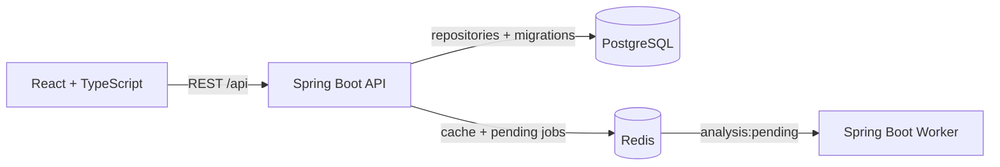

# Repository Intelligence

Repository Intelligence is a full-stack foundation for measuring the engineering health of GitHub repositories. This initial version connects and stores repository coordinates, caches repository reads, and queues placeholder analysis work. It does not yet clone repositories or calculate analytics.

## Architecture



| Component | Responsibility |
| --- | --- |
| `frontend/` | React 19 and TypeScript workspace for connecting repositories and viewing analysis states. |
| `backend/api/` | Java 21 Spring Boot 4.1.1 REST API, persistence, Flyway migrations, Redis caching, and job publishing. |
| `backend/worker/` | Java 21 Spring Boot 4.1.1 process that consumes queued repository IDs. Analytics are a placeholder. |
| `infrastructure/` | Infrastructure ownership notes and future deployment definitions. |
| `docker/` | Multi-stage images, Nginx routing, and the local Compose stack. |

## Run With Docker

Requirements: Docker with Compose.

```bash
cp .env.example .env
docker compose --env-file .env -f docker/compose.yml up --build
```

Open <http://localhost:5173>. The API is available at <http://localhost:8080> and the worker health endpoint at <http://localhost:8081/actuator/health>.

Stop the stack while preserving database and Redis volumes:

```bash
docker compose --env-file .env -f docker/compose.yml down
```

Add `--volumes` only when you intend to delete local application data.

## Run For Development

Requirements: Java 21 or newer, Node.js 22+, npm, and Docker.

Start only the data services:

```bash
docker compose -f docker/compose.yml up postgres redis
```

Then use separate terminals for each application:

```bash
cd backend/api && ./gradlew bootRun
cd backend/worker && ./gradlew bootRun
cd frontend && npm install && npm run dev
```

Vite proxies `/api` to `http://localhost:8080`. Set `VITE_API_URL` at frontend build time when the API is hosted on a different origin.

## Configuration

Configuration is externalized through environment variables. Defaults are suitable for local development and are documented in `.env.example`.

| Variable | Default | Used by |
| --- | --- | --- |
| `DATABASE_URL` | `jdbc:postgresql://localhost:5432/repo_intelligence` | API |
| `DATABASE_USERNAME` | `repo_intelligence` | API |
| `DATABASE_PASSWORD` | `repo_intelligence` | API |
| `REDIS_HOST` / `REDIS_PORT` | `localhost` / `6379` | API, worker |
| `REDIS_PASSWORD` | empty | API, worker |
| `FRONTEND_URL` | `http://localhost:5173` | API CORS |
| `ANALYSIS_QUEUE_NAME` | `analysis:pending` | API, worker |
| `ANALYSIS_POLL_DELAY_MS` | `2000` | Worker |
| `API_PORT` / `WORKER_PORT` | `8080` / `8081` | Services |

`POSTGRES_PORT`, `REDIS_PORT`, and `FRONTEND_PORT` control Docker host port mappings and default to `5432`, `6379`, and `5173`.

Do not commit `.env`; it is ignored by Git. A GitHub token is intentionally not part of the current contract because remote collection is not implemented yet.

## API

| Method | Path | Purpose |
| --- | --- | --- |
| `GET` | `/api/repositories` | List connected repositories. |
| `POST` | `/api/repositories` | Connect a repository using `{ "githubUrl": "https://github.com/owner/repository" }`. |
| `GET` | `/actuator/health` | Aggregate service health. |
| `GET` | `/actuator/health/liveness` | Process liveness probe. |
| `GET` | `/actuator/health/readiness` | Dependency readiness probe. |

## Verification

```bash
cd backend/api && ./gradlew test
cd backend/worker && ./gradlew test
cd frontend && npm run build && npm run lint
docker compose -f docker/compose.yml config --quiet
```

## Planned Analysis

The worker boundary is ready for future jobs covering repository activity, code churn, ownership concentration, complexity, dependency relationships, pull request metrics, hotspots, and engineering risk. Job retries, GitHub authentication, collection, scoring, and result schemas should be designed as the next phase rather than added to the placeholder consumer.
